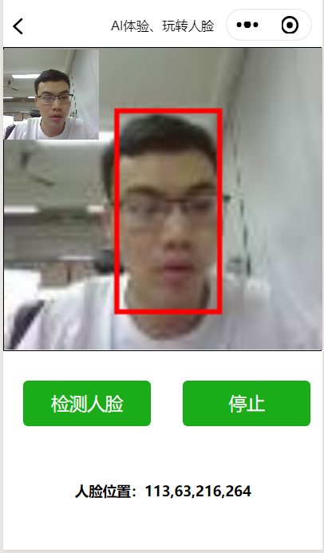
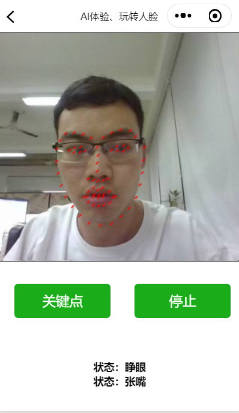
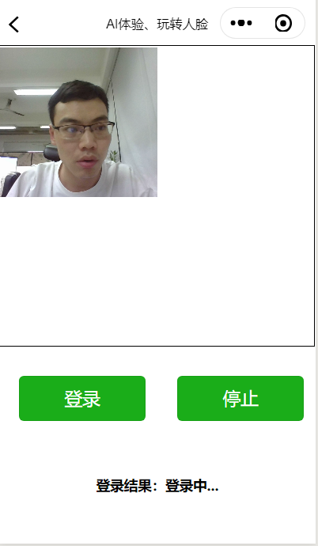
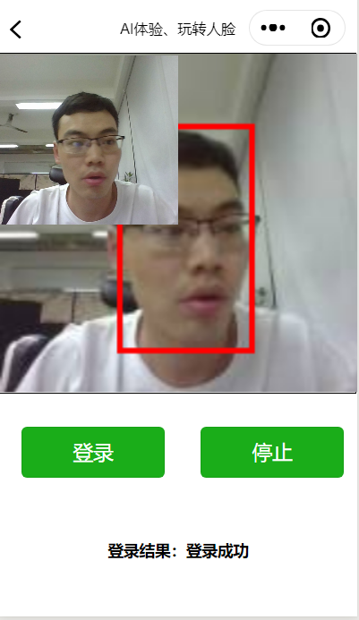
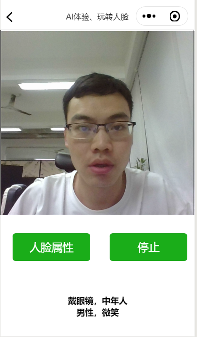

# AI体验、玩转人脸
* InsightFace工程在人脸识别开源工程中准确率很高，本文使用InsightFace工程中提供的预训练模型，

## 配置运行环境
* 读者需要先根据自己的Nvidia品牌显卡的型号，安装对应的CUDA版本。
* 根据作者的经验，Nvidia品牌20系列显卡需要安装CUDA10，否则运行代码会报错。
* 安装4个组件：CUDA10、cudnn7.6、tensorflow_gpu1.13、微信小程序开发工具。
### 硬件配置要求
大于等于6G显存的Nvidia品牌显卡

### 软件配置要求
各种软件版本：
* 操作系统: Windows10
* Anaconda： 5.2
* python: 3.6
* CUDA: 10.0
* cudnn: 7.6.1
* tensorflow_gpu: 1.13.1
* opencv_python: 4.1.0

### 1.包括功能
### 1.1 人脸检测
* 这里使用facenet_ssd训练了人脸检测模型，其模型也转为了pb模型在我们的文件中给出来了即face_detection_model.pb,其会将检测到的人脸框位置给予反馈。
* 其加载检测情况如下图所示：
* 

### 1.2 人脸关键点检测
* 这里加载了之前实习期间训练的人脸关键点检测模型，现在加载的模型准确率还是不够高，在公司用mobilenet-v2训练的人脸68关键点模型的准确率较好，但这里涉及XXX,不能在这里是使用：
* 同时，通过人脸关键点的位置情况，我们可以是实现一些比如检测眼睛、嘴巴睁开或者闭着的状态等情况,前公司在关键点模型上开发了驾驶行为分析的系统，这里我们可以做很多尝试。

## 1.3.人脸识别功能
* 先经人脸检测、然后将检测到的人脸送入训练好了人脸特征提取模型后，根据人脸特征之间的距离(相似度)进行判断是否属于同一个人脸、或者看人脸是否在自己的人脸注册库中，从而达到人判断和识别的功能。
* 1：人脸注册
* 
* 2：人脸登陆
* 

## 1.4.人脸属性识别
* 将检测到的人脸图像、送入训练好的人脸属性识别模型，从而进行一些常见的一些人脸属性识别功能：例如对性别、年龄、人脸表情状态、有没有戴眼镜等。
* 

